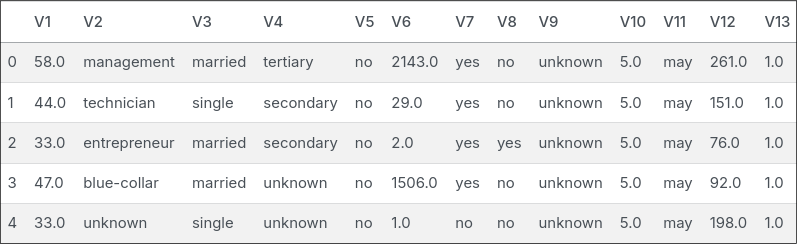
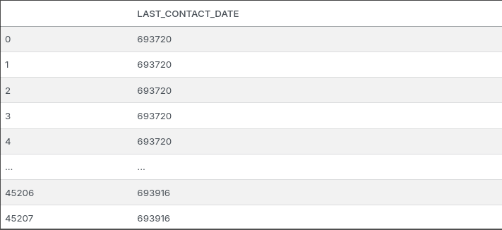
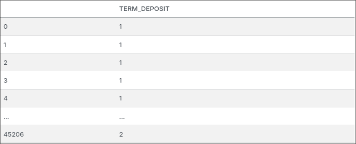
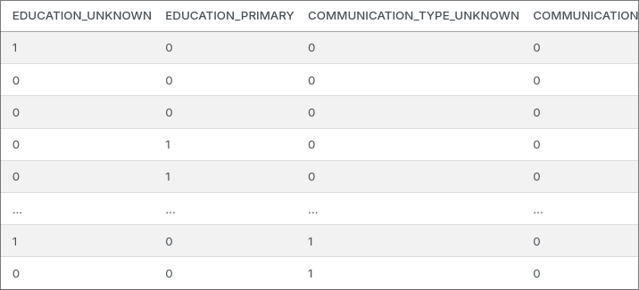

This project is created with the intention of fulfiling my curiosity. Some of the questions that I hope that I can answer by doing this project is:

1. What *type* of person is interested in subscribing to a term deposit?
2. With the assumption of using just calls to tell them about term deposit, is the action of just calling enough to persuade them? If it is enough what is the minimum time needed to know we have somewhat persuaded the person?
3. Between Logistic Regression and Support Machine Vector, which one is better?

The dataset that I am gona use is from a Portuguese banking institution marketing campaign. The goal of this dataset is to classify if the client will subscribe a term deposit. The original format of this file is `.arff` format which is suitable for machine learning and easier for machines to read.

To keep things simple I'm going to use only Logistic Regression and Support Machine Vector, another reason why I'm using only these models is to learn the workings of both models. At the end I'm going to compare its accuracy, to determine which is better. The results of this comparison is quite surprising.

## Cleaning Data

Taking a quick look at the data it's header are named using variables names, `V1, V2,...` because of this I first changed its headers to its associated description.

*Before Transformation*

*After Transformation*

After that I changed the `last_contact_day` and `last_contact_month` to become one column calling it `last_contact_date`. The reason for this change is because I found it a bit weird as to why it isn't combined to a single day. Additionally I added a line of code to change datetime to ordinal, to fit with the linear regression model.

*Before Transformation*

*After Transformation*

Then I changed the target `Y` which is the `term_deposit` column, for some odd reason its in 1 and 2. Which I personally found weird and didn't like it, so I applied `OrdinalEncoder` to become 0 and 1.

*Before Transformation*

*After Transformation*

Finally, some columns are categorical. I have thought of just using `OrdinalEncoder` but that will lead to the interpretation that it has a hierarchy, when there isn't. So I use `OneHotEncoder` class which transforms the these columns into a 1-column matrix, where each column is either `0` or `1`, where `0` mean "it doesn't belong to his category" while `1` is the opposite. In this matrix there can only be one `1` value.

*Before Transformation*

*After Transformation*

Note: After dealing with the categorical data, there were some other small changes to the dataframe which was converting floating data types to integer and re-indexing `term_deposit` to be the last column instead of the middle (this is due to transformations). 

## Logistic Regression
